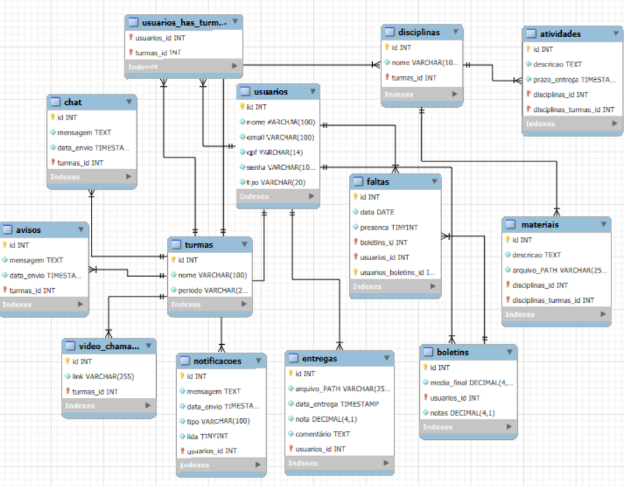

# NextClass

_NextClass: Educação Conectada e Eficiente_

> A NextClass é uma plataforma digital de ensino desenvolvida para facilitar a comunicação entre professores e alunos, oferecendo um ambiente virtual completo para o gerenciamento de atividades escolares. Com uma interface intuitiva e ferramentas práticas, a NextClass atende às demandas do ensino moderno de forma simples e eficaz.
Educadores podem criar turmas virtuais, postar materiais de apoio, atribuir tarefas, corrigir avaliações e acompanhar o desempenho dos estudantes em tempo real. Os alunos, por sua vez, têm acesso organizado a todo o conteúdo das disciplinas, podendo entregar trabalhos, entrar em vídeo chamaadas, participar de fóruns de discussão e receber feedback diretamente dos professores.

Professor: [Marco André Mendes](github.com/marcoandre)

Equipe:
- [Claudio Anzini Neto](github.com/ClaudioAnzini)
- [Gabriel Campregher Mohr](https://github.com/gabrielcmohr)
- [Matheus Henrique Calsavara](https://github.com/Math3usH)
- [Matheus Lopes Duarte](https://github.com/matheuslopesduarte)

Links do projeto:

-   Documentação: [DOC-Next-Class](github.com/marcoandre/pi-modelo)
-   Backend: [NextClass-BackEnd](https://github.com/TCC-Next-Class/NextClass-BackEnd)
-   Frontend: [NextClass-FrontEnd](https://github.com/TCC-Next-Class/NextClass-FrontEnd)

# 1. Desenvolvimento
*Sistema Educacional*

**Gerenciamento Escolar e Comunicação entre Professores e Alunos**

O sistema escolhido é o **NextClass**, uma plataforma educacional voltada para facilitar a organização das turmas, atividades e a comunicação entre professores e alunos.
Através da plataforma, será possível criar turmas, postar conteúdos e tarefas, acompanhar o desempenho dos alunos, enviar notificações e mensagens, além de gerar relatórios. O objetivo é tornar o processo de ensino mais organizado, moderno e acessível.
Escolhemos esse sistema por sua relevância no cenário atual da educação, além de permitir aplicar, na prática, conceitos importantes de desenvolvimento web, banco de dados e usabilidade.

# 2. Situação Problema

- Escolhemos o Instituto Federal Catarinese - Câmpus Araquari, uma instituição pública de ensino que oferece cursos integrados ao ensino médio e cursos superiores. A instituição apresenta dezenas de professores e centenas de alunos incritos.
- A instituição oferece o SIGAA como principal plataforma de gerenciamento acadêmico. Essa plataforma é críticada principalmente pela interface pouco intuitiva, lentidão e dificuldade de navegação. Diversos estudades reclamam de não conseguir encontrar informações básicas, além de que o SIGAA não oferece uma comunicação clara entre professor e aluno, onde fóruns e mensagens internas são pouco usados por conta da complexidade e visual antigo, fazendo muitos professores escolherem outras plataformas e apenas utilizando o SIGAA para a aplicação de nota.
- O principal intuito é criar uma plataforma intuitiva,acessivel, organizada e com comunicação eficiente, sendo possivel para os *professores* criar e gerenciar turmas, publicar materiais de aula, enviar atividades com prazos definidos, corrigir tarefas, registrar notas, além de se comunicar com os alunos por meio de avisos e mensagens diretas. Já para os *alunos*, será possivel acessar sua turma, visualizar conteúdos postados, entregar atividades, ver prazos de entrega, consultar notas, além de enviar dúvidas para o professor.
  
# 3. Descrição da proposta

O foco do sistema é a criação e gerenciamento das disciplinas, publicação de conteúdos, entrega de tarefas, corrigir e registrar notas, além de se comunicar com alunos por meio de chat ou vídeo chamada. Tudo sendo de forma integrada e simples.

O sistema será dividido em 2 principais níveis usuários:

| Nível de Usuário | Funções Principais |
|------------------|--------------------|
|Professores       |Criar turmas, publicar materiais, enviar atividades com prazos definidos, corrigir tarefas, registrar notas, se comunicar com alunos por meio de um chat ou vídeo chamada.|
|Aluno             | Acesso a turmas, visualizar conteúdos, entregar atividades, ver prazos de entrega, consultar notas e enviar dúvidas para o professor.|

# 4 .Modelagem de Dados

  

# 5. Regras de Negócio

#### RN0001 – Cadastro de Usuário: Um usuário novo tem que se cadastrar com nome, CPF, e-mail e senha;

#### RN002 – Perfis de Usuário: O sistema deve diferenciar perfis de professor, aluno e administrador;

#### RN003 – Criação de Turma: Apenas administradores podem criar as turmas;

#### RN004 – Entrar em Turmas: Alunos são colocados nas turmas pelos administradores;

#### RN005 – Publicação de Conteúdo: Professores podem postar materiais e tarefas;

#### RN006 – Entrega de Atividades: Alunos entregam atividades dentro do prazo definido pelo professor;

#### RN007 – Correção e Notas: Professores corrigem atividades e dão notas;

#### RN008 – Desempenho: Alunos podem ver suas notas;

#### RN009 – Comunicação: Professores e alunos se comunicam por chat e vídeo chamada;

#### RN010 – Notificações: O sistema envia avisos sobre novas tarefas, mensagens e notas;

#### RN011 – Fórum: Cada turma possui um espaço de discussão entre alunos e professor;

#### RN012 – Responsividade: A plataforma deve funcionar bem em qualquer dispositivo;

#### RN013 – Relatórios: Professores podem gerar relatórios de desempenho da turma;
